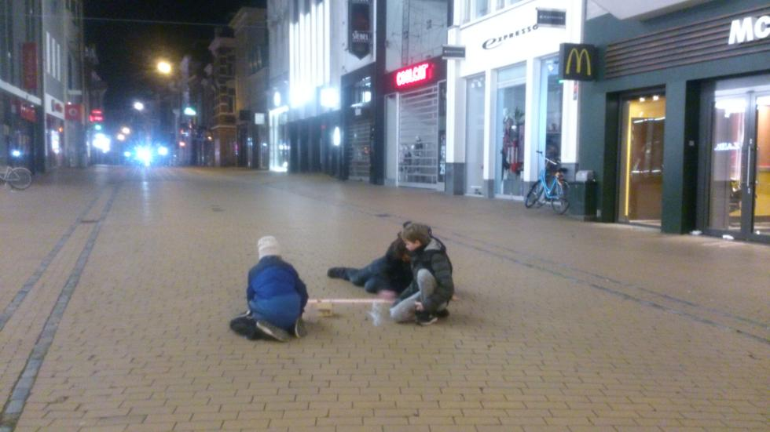
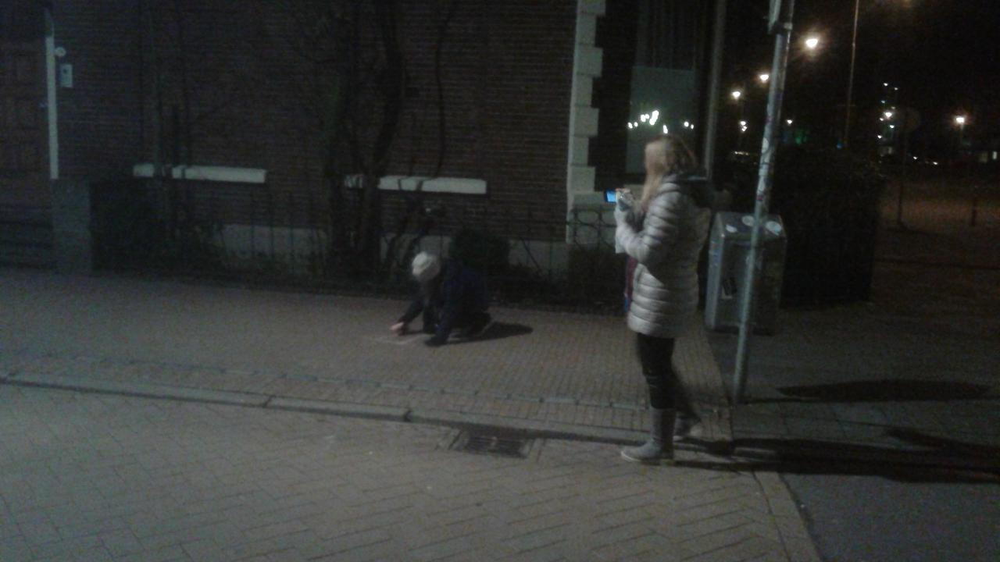
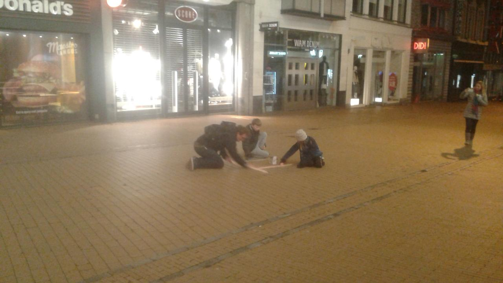

# Pi Day 2018

Pi Day 2018 has to celebrated in style!

This year, the crew consisted of B.S-B., M.B., M.P., R.B. and T.P. 

Sometimes we explicitly wished people a happy Pi Day:

The pi symbol was drawn with the most constrasting colors:

Sometimes the team spreads out:

Sometimes the team cooperates to make a big pi:

The big pi at the Grote Markt went completely wrong...

Informing the police about Pi Day:

## What to bring

Street chalk (NL: 'Stoepkrijt'). See FAQ below.

## Timetable

When|What
---|---
Tuesday March 13th 2018 23:57 (pi minutes before midnight)|Gather at bus stop P at Central Station Groningen
Wednesday March 14th 2018 00:03 (pi minutes after midnight)|Go into the city centre, write pi on street with street chalk
When no more street chalk, at around 1:23|Go home, sleep, enjoy Pi Day

## Where we gather

## 2017's route

## FAQ

### What will you do during the event?

We will write pi symbols on the street with
street chalk. When with a group, we usually
split the street into sections (left, right,
middle), that each person will write his/her
pi symbols on.

### Do I need to bring street chalk?

Preferably yes. But we will be happy to share
out stash of street chalk with anyone to join
in on the celabration, so we can go back to
sleep earlier.

### What if it rains?

If street chalk is useless against the weather, 
we abandon this celebration and go back to sleep

### What do you do after the celebration?

We go back to sleep, so we can be fit on Pi Day
during working hours.

### What does the police think about this?

During these events (Pi Day and Pi Approximation Day),
we usually encounter the police once. This Pi Day, 
we met them at the Grote Markt. After a friendly
conversation, they wished us a happy Pi Day and
left. 
